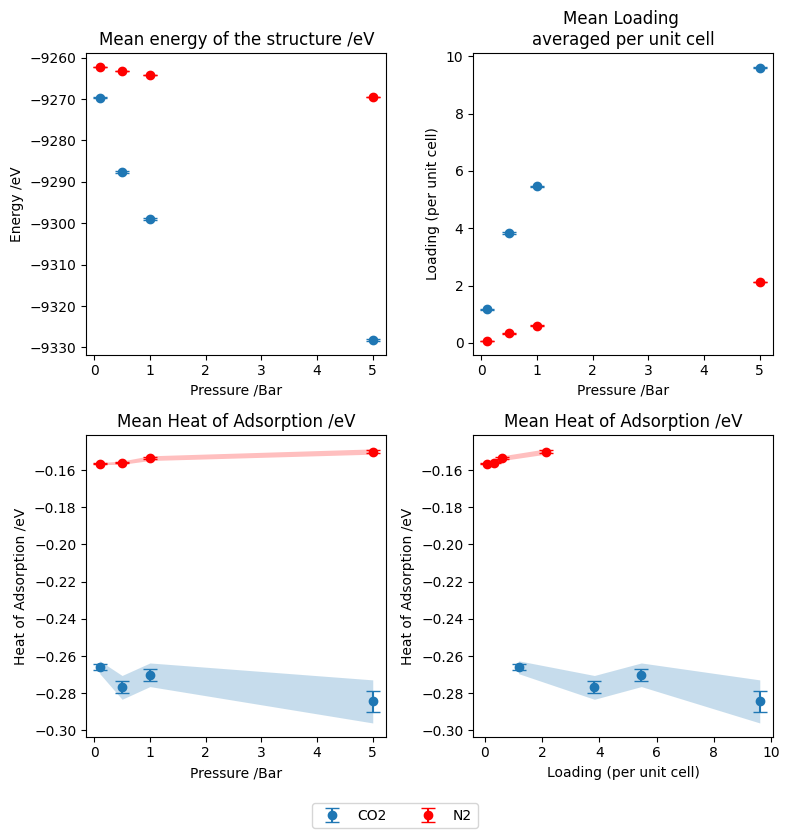

## Contents:
- [Purpose](#purpose)
- [Results so far](#results-so-far)
- [Planned extensions](#planned-extensions) - MACE model distilation (active learning)

## Purpose:
This mini project aims to explore GCMC techniques in modelling adsorption in MOFs. I plan to demonstrate my engagement with the challenges posed in this internship and demonstrate how my PhD work on MLIP and active learning methodology can translate into into gas adsorption in MOFs. This also serves as a way to explore the Cusp AI platform specifically the kUPS and widom packages.

## Results so far:
  GCMC - UFF/TraPPE - CO2/N2 adsorption in RUBTAK
  Widom - UFF/TraPPE and MACE - CO2/N2 adsorption in RUBTAK

GCMC: 
  - GCMC simulations were performed using UFF and TraPPE force fields to model CO2 and N2 adsorption in the MOF RUBTAK using the kUPS package.
  - The systems and potentials used were those in the kUPS example. Specific input/output files are included in the repo.
  

  Mean energy of the structure:
  This is plotted as a sanity check that no unreasonable structures are being generated. The key result here is that the mean energy of CO2 doped structures is lower than that of N2. This makes sense and is in line with the expectation that CO2 is more strongly adsorbed than N2 in this structure, with the caveat that this is total energy and also represents the greater loading seen for CO2. The mean energy of the structure is also lower than that of the empty structure, which is also expected as the adsorbed molecules are stabilising the structure.
  
  Mean Loading per unit cell:
  In these runs a 3x3x3 supercell was used, and as such we scale the loading to per unit cell values for comparison. For both adsorbates, we see an increase in loading with pressure as expected. We further see that CO2 has a higher loading which is again in line with the expectation that CO2 is more strongly adsorbed. This is not a demonstration of specific design choices of potential parameterisation, but comfort with using the kUPS package to run GCMC simulations.
  
  Mean Isosteric Heat of Adsorption:
  
  I plot this both as a function of the loading and the pressure, the typical plot would only include the loading however since the loading for N2 is substantially lower, this makes for a less clear visual comparison. One solution would be to run the N2 simulations at higher pressures to reach similar loading levels but this is beyond the scope for this mini project.
  
  One thing of note is that in both plots I present error bars. Hard error bars represent 1 SEM width and the shaded regions represent 2 SEM widths. This is to depict that for CO2 specifically, while some non-monotonic behaviour is seen in the isosteric heat of adsorption, it is within the error bars and as such not statistically significant. This also suggests that while there are favourable adsorption sites for CO2, they are either few in number or not dramatically more favourable than other sites. This could be a useful property for CO2 capture as this suggests the material will not saturate quickly, and conversely it will not be overly difficult to later remove the CO2.

Widom:
### Henry coefficients(K_H) of CO₂ in RUBTAK / mol/kg/Pa

|Temperature /K|Experiment|UFF/TraPPE|MACE-OMAT|MACE-MP 0b2|MACE-POLAR-m|
|--------------|---------:|---------:|--------:|----------:|-----------:|
| 298          |2.95e-5   |8.78e-5   |4.59e4   | 1.11e-7   | 3.16e-5    |
| 303          |2.26e-5   |7.42e-5   |2.70e4   | 1.05e-7   | 2.64e-5    |

### Henry coefficients(K_H) of N₂ in RUBTAK / mol/kg/Pa

|Temperature /K|Experiment|UFF/TraPPE|MACE-OMAT|MACE-MP 0b2|MACE-POLAR-m|
|--------------|---------:|---------:|--------:|----------:|-----------:|
| 298          |1.98e-6   |4.21e-6   |2.81e-8  | 1.93e-8   | 4.15e-6    |
| 303          |2.46e-6   |3.81e-6   |2.74e-8  | 1.90e-8   | - |

Reported MAE of UFF/TraPPE vs experiment: CO2 - 0.0299 eV, N2 - 0.0190 eV

In this experiment, the UFF/TraPPE results were obtained using the kUPS widom method and experimental values from the Open DAC 2025 paper. MACE results were obtained using standalone Cusp AI widom package. Serving as an exploration of both methods but also to address a limitation that ASE based LJ calculators do not natively support different parameters based on atom type. 

Results for the UFF/TraPPE potentials, converted from mol/kg/Pa to eV, are exactly in line with what is reported in the benchmark paper CO2 and N2 Henry coefficients are recovered to values within the MAE reported. 

UFF/TraPPE Widom insertion results are consistent with GCMC results, the henry coefficient is higher for CO2 than N2 by an order of magnitude, suggesting much stronger interactions. This correlates with the higher loading and more favourable isosteric heat of adsorption seen in the GCMC simulations. The relatively consistent isosteric heat of adsorption across loading suggests relatively equal binding energy across sites, with no population of dramtically more favourable sites. This is consistent with the chemistry of the MOF, with no open metal sites, pointing to K_H reflecting a broad average across comparable sites.

When looking at MACE type models, which are not directly trained on MOF data, we can see performace deteriorates by a fair bit. For most cases the MACE models underpredict K_H by two orders of magnitude. This suggests that the MACE models predict weaker interactions. In Part this will be due to a lack of charged interactions. MACE models can implicitly learn local electrostatic interactions, povided they can be expressed in the descriptor. However there is no formal charge infromation, for UFF/TraPPE this is achieved using Ewald summation, and since MOF interactions are often dominated by physisorption, missing these favourable interactions is likely the cause of the underpredicion.

In this same vein, running Widon insertion with MACE-POLAR not only corrects the major issues seen in other MACE models, but for CO2, the K_H is even more accurate than that of the UFF/TraPPE potential with ewald charges. With MACE-POLAR there are two main changes. The first is the molecular data seen in the training set (something that active learning can address in other models), but more importantly the description of charges. I would argue that this makes the biggest difference when modelling MOFs, and is not something that can be address with active learning/distilling unless your model has some charge description. 
## Planned extensions:
  - GCMC - MACE - reweighting to see alignment with UFF/TraPPE generated structures
  - Foundation MACE model distillation - training of a smaller model to be used in GCMC simulations
  - Benchmarking of the distilled model against MACE results, and if successful, against UFF/TraPPE GCMC results

The Key planned extension is to distill a foundation MACE model into a smaller model usable for GCMC calculations that retains foundation level accuracy. Due to the time cost of this task, and my hope to send off the application soon, I will fully explain the planned approach here, but can not guarantee I will have results by the time this is seen.

The plan:
  - Take UFF/TraPPE generated structures (as a good start), evaluate a subset with a foundation MACE model and train a small mace model (distillation).
  - The size of the model will be reduced by controlling r-max, num channels and complexity through parameters such as correlation (last option). The goal is to reduce the model to a size suitable to run GCMC (likely through LAMMPS).
  - The reduced parameter count and complexity will reduce accuracy, the correction to this would be to enter the large data regime, accessible due to the efficiency of foudation models (compared to DFT).
  - The UFF/TraPPE potential will bias sampled data to its equilibrated loading, to correct this a committee (size 3-5) of small models will be trained and used to propogate GCMC/widom insertion.
  - Structures will be selected by uncertainty (discussed later), labled with the foundation model and used to train the next generation of models much like in my preprint (Active Learning)
  - INTERESTING NOTE - foundation models are kown to poorly predict MOF/adsorbate interactions, due to lack of data coverage, charges etc. Architectures like MACE-POLAR or MACE-LES can be used but are more expensive but there are two iteresting paths.
    - Finetune the foudnation model before you begin distilation, something that is likely already planned via the ODAC2025 dataset for a better starting point.
    - Lean into the locality of MACE models, reduce the r_max and a second corrective potential for charges (potentially an empirical one). Not only would this lead to a smaller faster model, but the locality means that in larger GCMC calculations the neighbour graphs can be updated less frequently and can be done so only around the inserted molecule with potential savings in energy  evaluation. The lower memory usage could also allow for running on cheaper smaller GPUs or the running of multiple structures on a single GPU to maximise efficiency.

Active learning: 

In the proposed active learning step, there are two paths. You can sample over diversity: run gcmc with 1 model (faster) and sample the resultant trajectory, aiming to correct the UFF/TraPPE generation bias rather than potential uncertainties. The second (slower) method sees a committee derived uncertainty, most likely targeting uncertainty in energy prediction (more important in GCMC/Widom calculations), looking further at uncertainty localised to the adsorbates. While the second method is likely to be more robust in the interest of time for this mini project I will focus on method 1.

 
